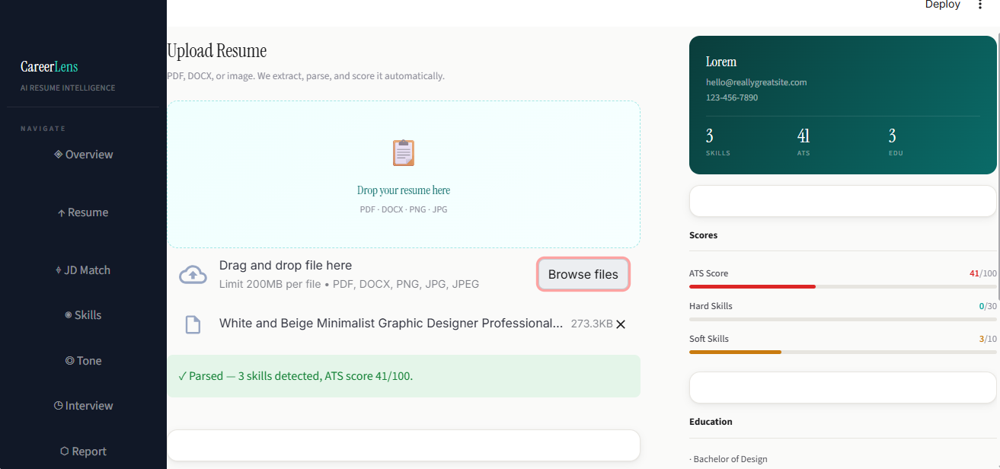
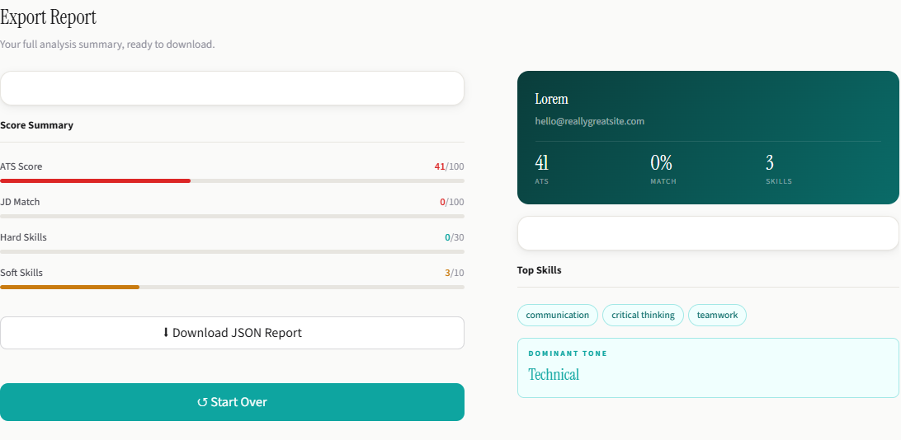
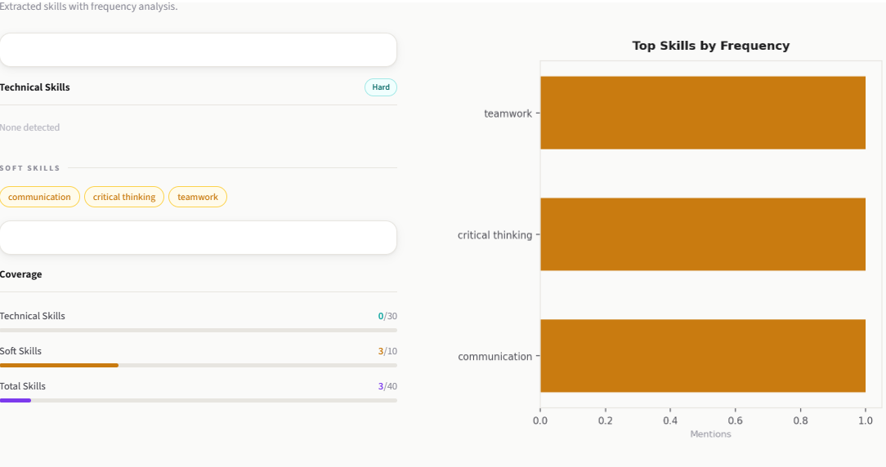

# 🚀 CareerLens AI
### Intelligent Resume Analyzer powered by AI & NLP

<div align="center">


**Transform your resume with AI-powered insights and land your dream job**

[Live Demo](https://huggingface.co/spaces/shree0302/careerlens-ai) • [Report Bug](https://github.com/sathiya-shree/careerlens-ai/issues) • [Request Feature](https://github.com/sathiya-shree/careerlens-ai/issues)

</div>

---

## 🌟 Overview

**CareerLens AI** is an intelligent resume analysis platform that leverages cutting-edge AI and Natural Language Processing to help job seekers create compelling, ATS-friendly resumes. Upload your resume and receive instant, actionable feedback powered by Google's Gemini AI.

### 🎯 Why CareerLens AI?

- **🤖 AI-Powered Analysis**: Get expert-level resume feedback using Google Gemini
- **📊 Visual Insights**: Understand your skill distribution at a glance
- **🔍 Smart Extraction**: Automatic detection of skills, technologies, and competencies
- **📄 Multi-Format Support**: Works with PDF, DOCX, TXT, and even image resumes
- **⚡ Instant Results**: Real-time analysis in seconds

---

## 🌐 Live Demo

<div align="center">

### **[Try CareerLens AI on Hugging Face 🤗](https://huggingface.co/spaces/shree0302/careerlens-ai)**

Hosted on **Hugging Face Spaces** for seamless access and performance

</div>

---

## 📸 Screenshots

<div align="center">

### Resume Upload Interface


### AI-Powered Analysis Dashboard


### Interactive Skills Visualization


</div>

---

## ✨ Key Features

### 📤 **Universal Resume Upload**
- ✅ PDF Documents
- ✅ Word Documents (DOCX)
- ✅ Plain Text (TXT)
- ✅ Image Resumes (PNG/JPG) with OCR

### 🧠 **Intelligent AI Analysis**
Powered by **Google Gemini API**, the system provides:
- ✨ Comprehensive resume structure evaluation
- 💡 Personalized improvement recommendations
- 🎯 Missing information identification
- 📈 Industry-aligned skill suggestions
- 🔍 Content quality assessment

### 🔬 **Advanced NLP Processing**
Utilizing **spaCy** for:
- 🐍 Programming language detection
- 🛠️ Framework and tool identification
- 💼 Professional skill extraction
- 🏷️ Technology stack analysis

### 📊 **Visual Analytics**
- Beautiful skill distribution charts using **Matplotlib**
- Interactive visualizations
- Export-ready graphics

### 🖼️ **OCR Technology**
Extract text from image resumes using:
- **Tesseract OCR** engine
- **Pillow** for image processing
- High-accuracy text recognition

---

## 🛠️ Tech Stack

<div align="center">

| Technology | Purpose | Badge |
|------------|---------|-------|
| **Python 3.9+** | Core Language |  |
| **Streamlit** | Web Framework |  |
| **Google Gemini** | AI Analysis |  |
| **spaCy** | NLP Engine |  |
| **Matplotlib** | Visualization |  |
| **pdfplumber** | PDF Parsing |  |
| **Tesseract OCR** | Image Text Extraction |  |
| **Hugging Face** | Deployment |  |

</div>

---

## 📂 Project Structure

```
careerlens-ai/
│
├── app.py                    # Main Streamlit application
├── requirements.txt          # Python dependencies
├── packages.txt             # System-level dependencies
├── README.md                # Project documentation
│
├── screenshots/             # Application screenshots
│   ├── upload.png
│   ├── analysis.png
│   └── skills_chart.png
│
└── .streamlit/              # Streamlit configuration
    └── secrets.toml         # API keys (not committed)
```

---

## 🚀 Quick Start

### Prerequisites

- Python 3.9 or higher
- pip package manager
- Google Gemini API key ([Get one here](https://makersuite.google.com/app/apikey))

### Installation

1️⃣ **Clone the repository**
```bash
git clone https://github.com/sathiya-shree/careerlens-ai.git
cd careerlens-ai
```

2️⃣ **Install Python dependencies**
```bash
pip install -r requirements.txt
```

3️⃣ **Download spaCy language model**
```bash
python -m spacy download en_core_web_sm
```

4️⃣ **Configure API credentials**

Create `.streamlit/secrets.toml`:
```toml
GEMINI_API_KEY = "your_gemini_api_key_here"
```

5️⃣ **Launch the application**
```bash
streamlit run app.py
```

6️⃣ **Open in browser**
```
http://localhost:8501
```

---

## 🌍 Deployment

### Hugging Face Spaces (Recommended)

This project is currently deployed on **Hugging Face Spaces**:

**Live URL**: https://huggingface.co/spaces/shree0302/careerlens-ai

#### Deploy Your Own Instance:

1. Fork this repository
2. Create a new Space on [Hugging Face](https://huggingface.co/spaces)
3. Connect your GitHub repository
4. Add your `GEMINI_API_KEY` in Space settings → Secrets
5. Deploy automatically!

### Alternative Platforms

- **Streamlit Cloud**: One-click deployment from GitHub
- **Render**: `render.yaml` compatible
- **Railway**: Auto-deployment from Git
- **Heroku**: Procfile included

---

## 🔒 Security & Privacy

- 🔐 API keys stored securely using **Streamlit Secrets**
- 🚫 Sensitive data **never committed** to version control
- 🗑️ Uploaded resumes **not stored** on servers
- ✅ GDPR and privacy-compliant processing

---

## 📈 Roadmap

### Coming Soon

- [ ] **ATS Score Calculator** - Industry-standard scoring system
- [ ] **Job Description Matcher** - Compare resume against JD
- [ ] **AI Resume Rewriter** - Automated content optimization
- [ ] **LinkedIn Profile Analyzer** - Cross-platform insights
- [ ] **PDF Report Export** - Download detailed feedback
- [ ] **Multi-language Support** - Analyze non-English resumes
- [ ] **Resume Templates** - AI-suggested formatting
- [ ] **Keyword Optimization** - SEO for resumes

---

## 🤝 Contributing

Contributions make the open-source community amazing! Any contributions you make are **greatly appreciated**.

1. Fork the Project
2. Create your Feature Branch (`git checkout -b feature/AmazingFeature`)
3. Commit your Changes (`git commit -m 'Add some AmazingFeature'`)
4. Push to the Branch (`git push origin feature/AmazingFeature`)
5. Open a Pull Request

---

## 📝 License

Distributed under the **MIT License**. See `LICENSE` for more information.

---

## 👨‍💻 Author

<div align="center">

**Sathiya Shree**

[](https://github.com/sathiya-shree)
[](https://linkedin.com/in/sathiya-shree)
[](https://your-portfolio-url.com)

</div>

---

## 🙏 Acknowledgments

- [Google Gemini](https://ai.google.dev/) for powerful AI capabilities
- [Hugging Face](https://huggingface.co/) for reliable hosting
- [Streamlit](https://streamlit.io/) for the amazing framework
- [spaCy](https://spacy.io/) for NLP excellence
- Open-source community for continuous support

---

<div align="center">

### ⭐ Star this repository if you find it helpful!

**Made with ❤️ by [Sathiya Shree](https://github.com/sathiya-shree)**

</div>
